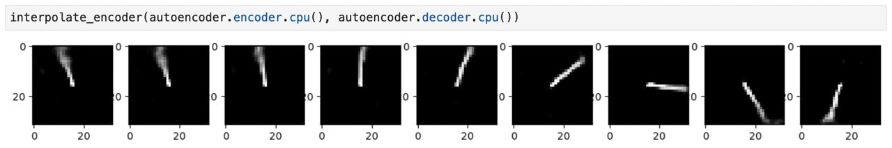

# Adversarially-constrained Autoencoder Interpolation

Here are the intermediate result for ACAI notebook:

## TODO
- [x] Find out why the code is not deterministic in terms of loss history, and fix it
- [x] Add functionality to visualize interpolation dynamics
- [x] Rewrite visualization logging through external callbacks or smth like this
- [ ] Experiment: default lambda
- [ ] Experiment: L2 -> L1
- [ ] Experiment: correct train/eval mode
- [ ] Experiment: AvgPool -> MaxPool
- [ ] Experiment: LeakyReLU -> ReLU
- [ ] Experiment: remove batchnorm
- [ ] Experiment with MNIST dataset