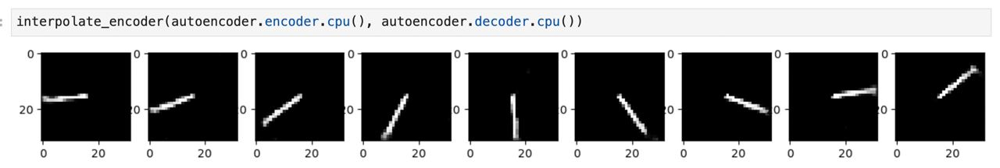
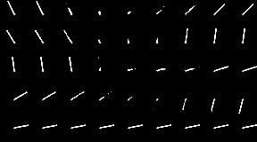
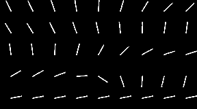

# Adversarially-constrained Autoencoder Interpolation

Implementation and experiments for ACAI model from "Understanding and Improving Interpolation in Autoencoders via an Adversarial Regularizer" ([arxiv](https://arxiv.org/pdf/1807.07543.pdf)).

Classic autoencoder        |  ACAI
:-------------------------:|:-------------------------:
  |  
